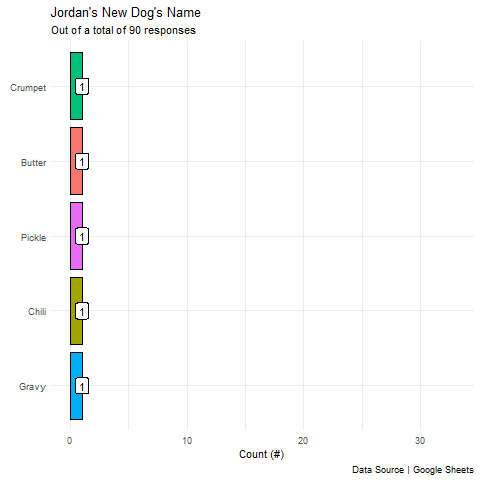

# Google Survey for Pet Names

Joke repo for democratizing naming my new dog.

<br>

# The Dog


<br>

# Winner



<br>

# Session Info

```
R version 4.1.0 (2021-05-18)
Platform: x86_64-w64-mingw32/x64 (64-bit)
Running under: Windows 10 x64 (build 19042)

Matrix products: default

locale:
[1] LC_COLLATE=English_United States.1252  LC_CTYPE=English_United States.1252   
[3] LC_MONETARY=English_United States.1252 LC_NUMERIC=C                          
[5] LC_TIME=English_United States.1252    

attached base packages:
[1] stats     graphics  grDevices utils     datasets  methods   base     

other attached packages:
 [1] lubridate_1.7.10    gganimate_1.0.7     forcats_0.5.1       stringr_1.4.0      
 [5] dplyr_1.0.6         purrr_0.3.4         readr_1.4.0         tidyr_1.1.3        
 [9] tibble_3.1.2        ggplot2_3.3.3       tidyverse_1.3.1     googlesheets4_1.0.0

loaded via a namespace (and not attached):
 [1] Rcpp_1.0.7        here_1.0.1        prettyunits_1.1.1 assertthat_0.2.1 
 [5] rprojroot_2.0.2   digest_0.6.27     utf8_1.2.1        R6_2.5.0         
 [9] cellranger_1.1.0  backports_1.2.1   reprex_2.0.0      evaluate_0.14    
[13] httr_1.4.2        pillar_1.6.1      rlang_0.4.11      progress_1.2.2   
[17] curl_4.3.1        readxl_1.3.1      rstudioapi_0.13   gifski_1.4.3-1   
[21] rmarkdown_2.8     labeling_0.4.2    googledrive_2.0.0 munsell_0.5.0    
[25] broom_0.7.6       xfun_0.23         compiler_4.1.0    modelr_0.1.8     
[29] janitor_2.1.0     pkgconfig_2.0.3   askpass_1.1       htmltools_0.5.1.1
[33] openssl_1.4.4     tidyselect_1.1.1  fansi_0.5.0       crayon_1.4.1     
[37] dbplyr_2.1.1      withr_2.4.2       rappdirs_0.3.3    grid_4.1.0       
[41] jsonlite_1.7.2    gtable_0.3.0      lifecycle_1.0.0   DBI_1.1.1        
[45] magrittr_2.0.1    scales_1.1.1      cli_3.0.1         stringi_1.6.1    
[49] farver_2.1.0      fs_1.5.0          snakecase_0.11.0  xml2_1.3.2       
[53] ellipsis_0.3.2    generics_0.1.0    vctrs_0.3.8       tools_4.1.0      
[57] glue_1.4.2        tweenr_1.0.2      hms_1.1.0         colorspace_2.0-1 
[61] gargle_1.2.0      rvest_1.0.0       knitr_1.33        haven_2.4.1    
```
